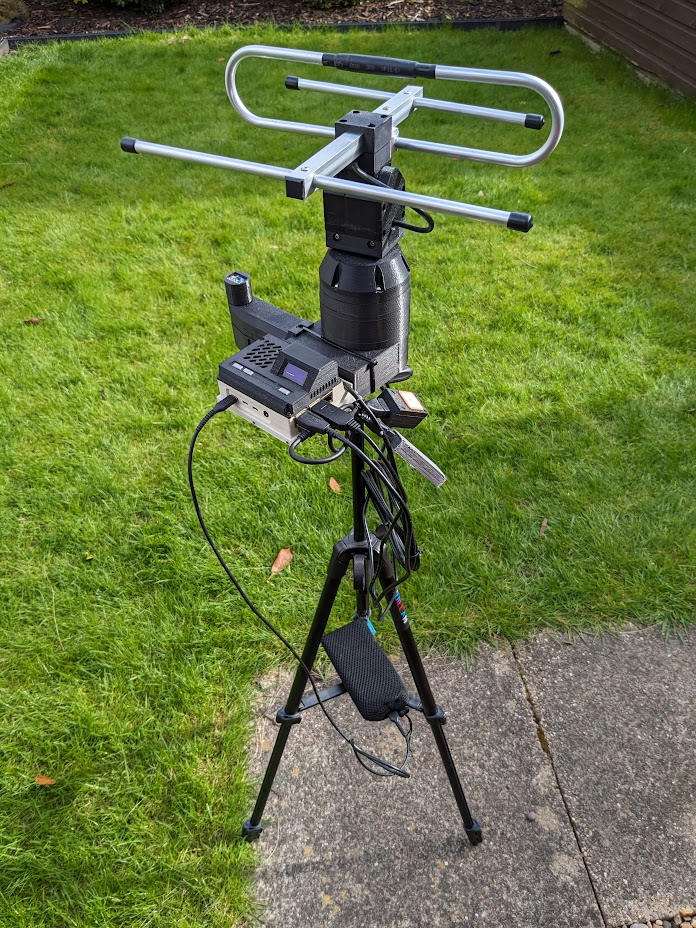
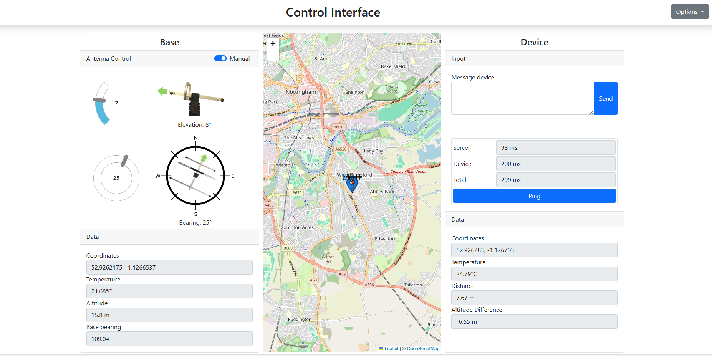
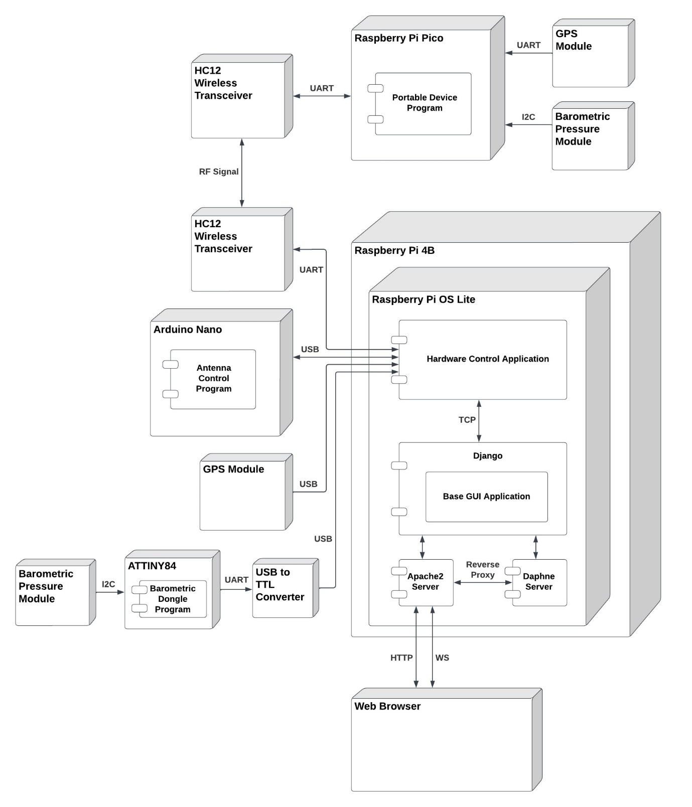
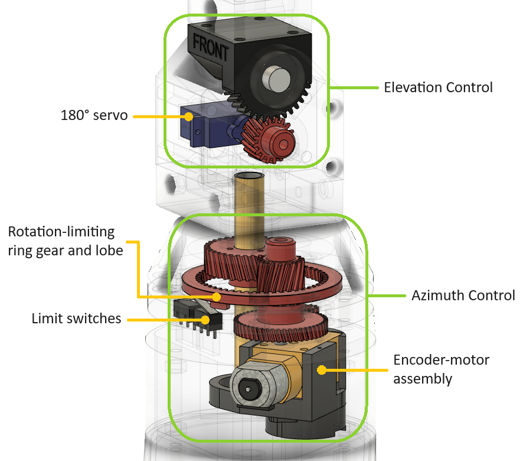
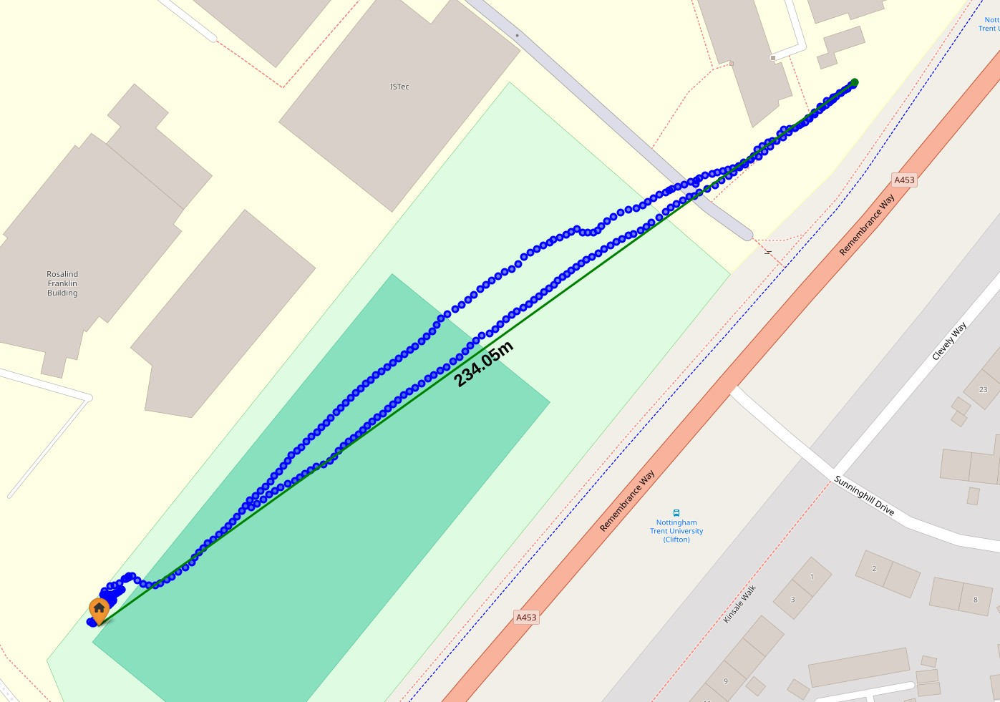

# Tracking Antenna — Base Control Application

A Django web application that controls a directional tracking antenna in real time, built as my final year project at Nottingham Trent University (2024). The antenna physically follows a moving portable device using GNSS positioning and barometric pressure, extending the usable range of a short-range wireless module by over 500%.

This repository contains the **base control software** — the Django app, the hardware control daemon, and the deployment configuration that runs on a Raspberry Pi 4B. The companion repository [FYP_RPi_Pico_Portable_Device](https://github.com/Ms1Dev/FYP_RPi_Pico_Portable_Device) contains the firmware for the portable device that the antenna tracks.



## What it does

A user opens a browser, connects to the Raspberry Pi over LAN (or directly via the Pi's own access point when deployed off-grid), and sees a real-time control interface:

- A map showing the live position of both the antenna and the portable device.
- Manual override dials for elevation and azimuth.
- A messaging panel for sending text to the portable device.
- A ping feature for measuring round-trip latency through the system.

In automatic mode, the Pi continuously calculates the bearing and elevation needed to point the antenna at the portable device and dispatches movement commands to a microcontroller-driven gimbal. The whole loop — portable device transmits GNSS → base receives → recalculates pointing → moves the antenna — runs in real time over a half-duplex 433 MHz wireless link.



## Architecture

The system is split into two cooperating processes on the Pi, plus a stack of supporting infrastructure:



**Why two processes?** Hardware control needs to run continuously as a single instance, polling serial ports and driving actuators. A web app runs in response to requests and may spin up multiple workers. Putting both in one Django process would have been a mess. Instead:

- A **hardware daemon** (`RPi_Hardware/`) owns all the serial ports, the antenna control logic, and the sensor polling. It runs as a `systemd` service.
- The **Django app** (`BaseGui/`, `BaseGuiApp/`) serves the UI, handles WebSocket connections, and acts as a thin bridge between the browser and the hardware daemon.
- The two processes communicate over **ZeroMQ** on localhost — a pub/sub socket for hardware-to-web telemetry and a push/pull socket for commands going the other way.

**Real-time updates to the browser** are handled by Django Channels over WebSockets. The consumer is asynchronous so it can poll the ZMQ socket without blocking the event loop. Apache2 serves HTTP and reverse-proxies WebSocket traffic to a Daphne ASGI server running on port 8001:

```apache
<Location /ws/>
    RewriteEngine On
    RewriteCond %{HTTP:Upgrade} =websocket [NC]
    RewriteRule /ws/gui/ ws://127.0.0.1:8001/ws/gui/ [P,L]
    ProxyPass http://127.0.0.1:8001/ws/gui/ flushpackets=on
    ProxyPassReverse http://127.0.0.1:8001/ws/gui/
</Location>
```

`flushpackets=on` was important — without it Apache buffers outbound WebSocket frames and tracking updates arrive in bursts instead of smoothly.

**Offline mode.** The Pi is often deployed in fields with no Wi-Fi. A bash script reconfigures it to act as a hostapd access point so a phone or laptop can connect directly and reach the web UI. A small OLED screen and buttons on the base unit let the user switch modes without needing a connected client.

## The hardware being controlled



A two-axis gimbal carrying a 433 MHz Yagi-Uda directional antenna. Elevation is driven by a positional servo with a 2:1 reduction gear; azimuth uses a DC motor with a 3D-printed quadrature optical encoder for positional feedback and two limit switches to prevent wiring damage from over-rotation. The motor and encoder are controlled by an Arduino Nano that communicates with the Pi over USB serial.

Two USB peripherals provide the Pi's own positional awareness:

- A **GNSS dongle** (U-Blox NEO-M8N) for latitude/longitude.
- A custom-built **barometric pressure dongle** (BMP180 + ATTINY84 + USB-to-TTL) for relative altitude. GPS altitude was too noisy to use, so I built a separate sensor that averages 100 readings and is calibrated against the portable device on startup.

## Results

The full evaluation is in the project report, but the headlines:

- **Range:** the baseline HC-12 module managed 37 m with its stock antenna. With the tracking system, the same module reliably reached 234 m — the maximum testable distance on the available field, with no signal loss at that range.
- **Tracking:** held the portable device through a full 360° sweep and through a perimeter walk that demanded continuous azimuth correction.
- **Latency:** mean round-trip from browser → server → portable device → server → browser was 253 ms (median 222 ms), of which roughly 113 ms is the wireless link itself.



## Repository layout

```
BaseGui/          # Django project (settings, ASGI/WSGI, URL routing)
BaseGuiApp/       # The Django app — views, consumers, templates, static assets
RPi_Hardware/     # Standalone Python daemon for hardware control
systemd/          # Service unit files for Daphne and the hardware daemon
apache/           # Reverse-proxy site configuration
scripts/          # Bash scripts for switching between station and AP mode
```

## Running it

This software is tightly coupled to its hardware — without the antenna, portable device, and sensor dongles it doesn't do anything useful — but the Django app will start in isolation for inspection:

```bash
python -m venv project_venv
source project_venv/bin/activate
pip install -r requirements.txt
python manage.py migrate
python manage.py runserver
```

The hardware daemon expects specific USB devices to be present and will exit if they're missing. The full deployment (Apache + Daphne + systemd services) is documented in `apache/` and `systemd/`.

## Context

This was my final year project for a BSc (Hons) Software Engineering at Nottingham Trent University, awarded First-Class Honours. The project changed direction partway through — the original plan was to use the HC-12 module to control a wireless robot, but evaluation testing showed the module's real-world range was a fraction of its advertised range. Rather than abandon it for a different wireless technology, I designed a tracking-antenna solution that would extend the range of the existing module — and, in principle, any other half-duplex directional wireless system.

The full project report is available on request.
